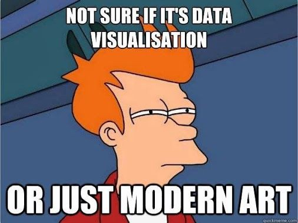

# Data visualization with D3.js
## Puzzle Tech Workshop

12.09.2019

Khôi Tran tran@puzzle.ch

---

## First things first

Presentation:

`git clone https://github.com/puzzle/techworkshop-d3`

`npm i && npm start`


D3.js sandbox:

`git clone https://github.com/keetraxx/d3-sandbox`

`npm i && npm start`

---

## Agenda

Morning:
* Introduction to D3.js
* Hacking session

Afternoon:
* Hacking session (cont.)
* Introduction to GeoJSON
* Hacking session 2

---

## What is data visualization about?

Data is everywhere. Every application sits on a lot of data.
Databases, Logfiles, etc.

**The creative work** is to take this data and visualize it in a interesting way to create value.

---

## Examples

* [Chicago Killings](https://archive.nytimes.com/www.nytimes.com/interactive/2013/01/02/us/chicago-killings.html)
* [D3 Tetris](http://d3tetris.herokuapp.com/#)
* [German Travelling](https://projects.christianlaesser.com/travel-visa-inequality/)
* [Best D3 web sites](https://www.awwwards.com/websites/d3/)
* [D3 Techworkshop](https://github.com/puzzle/techworkshop-d3) (140 LOC!)

---

## What is D3.js not?

* IT'S NOT: A library to simply generte charts
* IT'S NOT: Something that works "out-of-the-box"

---

## What is D3.js then?

* A myriad of functions to facilitate creation of visualizations
* Most well-known web-visualization libraries depend on D3.js (billboard.js, chartJS, etc.)

> "D3.js is JQuery / lodash / underscore for visualizations" - anonymous, 2019

---

## How does D3.js work?

* Maps data internally to a DOM element.
* When you manipulate a DOM element, D3.js knows it's data.

---

## How to work with D3.js

1. Get your data
2. (optional) Transform your data into something more workable
3. (optional) Put data into a layout function
4. Bind data to DOM elements

---

## Basic: Add new DOM elements

```javascript
// 1) Get your data
var data = [{name: 'Anna'}, {name: 'Ben'}, {name: 'Christoph'}];

// 4) Bind data to DOM elements (steps 2/3 skipped)
var list = d3.select('aside')
  .selectAll('p')
  .data(data);

// "actions" on new entries
list.enter()
  .append('p')
  .text(d => d.name);
```

---

## Advanced: Handle existing and removed elements

```javascript
var data = [{name: 'Anna'}, {name: 'Ben'}, {name: 'Christoph'}];

var list = d3.select('aside')
  .selectAll('p')
  .data(data, d => d.name);

// actions on existing entries
list.style('opacity', 0.5);

// "actions" on new entries
list.enter()
  .append('p')
  .text(d => d.name)
  .merge(list) // "actions" on both new AND existing entries
  .style('text-weight', 'bold');

// "actions" on removed entries
list.exit()
  .style('text-decoration', 'line-through'); // removes element from DOM
```

---

## Transitions

```javascript
var data = [{name: 'Anna'}, {name: 'Ben'}, {name: 'Christoph'}];

var list = d3.select('aside')
  .selectAll('p')
  .data(data, d => d.name);

list.enter()
  .append('p')
  .text(d => d.name)
   // set attributes before transition
  .style('transform', 'translate(1em, -1em)rotate(30deg)')
  .style('opacity', 0)
  .transition()
  // set attributes to transition to
  .delay((d,i) => 300 * i)
  .duration(800)
  .ease(d3.easeBounceOut)
  .style('transform', null) // reset to default
  .style('opacity', 1);
```

https://github.com/d3/d3/blob/master/API.md#transitions-d3-transition

---

## D3.js scales

Maps input (domain) to output (range)

`0, 1, 2, 3, 4 => -5, 0, 5, 10, 15`

```javascript
var myScale = d3.scaleLinear()
  .domain([0, 4])
  .range([-5, 15]);

myScale(3); // => 10
```

https://github.com/d3/d3/blob/master/API.md#scales-d3-scale

---

## D3.js scales (2)

Possible with colors and date objects as well:

```javascript
var howWhiteAreMyHairs = d3.scaleLinear()
  .domain([new Date(), new Date('1950')])
  .range(['#000', '#fff']);

d3.select('svg')
  .append('rect')
  .attr('width', 100)
  .attr('height', 100)
  .style('fill', howWhiteAreMyHairs(new Date("1982-04-23")));
```

---

## Scales in usage

```javascript
var data = [{name: 'Anna'}, {name: 'Ben'}, {name: 'Christoph'}];
var color = d3.scaleLinear()
  .domain(d3.extent(data, d => d.name.length))
  .range(['#0f0', '#f00']);

var list = d3.select('aside')
  .selectAll('p')
  .data(data);

list.enter()
  .append('p')
  .style('color', d => color(d.name.length))
  .text(d => d.name);
```

---

## D3.js shapes

Map an input to a `string` compatible with SVG `<path d="..." />`

* `d3.line()`
* `d3.area()`
* `d3.radialArea()`
* `d3.arc()`

---

## `d3.line()` example

```javascript
var data = [{name: 'Anna'}, {name: 'Ben'}, {name: 'Christoph'}];
var line = d3.line()
  .x((d,i) => i * 100) // for simplicity! Usually use a scale here!
  .y(d => -d.name.length * 20);

d3.select('svg')
  .append('path')
  .attr('d', line(data));
```

---

## D3.js Axes

Draws a scale on a SVG `<g>` element.

```javascript
var data = [{name: 'Anna'}, {name: 'Ben'}, {name: 'Christoph'}];

var scale = d3.scaleLinear()
  .domain([0, d3.max(data, d => d.name.length)])
  .range([400, 0]);

var yAxis = d3.axisLeft()
  .scale(scale);

d3.select('svg')
  .append('g')
  .call(yAxis);
```

---

# Time to swim in the cold water!

Try to make a line chart using:

`src/example-data/btc-chf-conversion.json`


---

## D3.js data transformation `d3.nest()`

```javascript
var data = [{name: 'orange', type: 'fruit'}, {name: 'apple', type: 'fruit'}, {name: 'cucumber', type: 'vegetable'}];

var groupByType = d3.nest()
  .key(d => d.type);

groupByType.entries(data);
```

---

## D3.js hierarchies

A d3 hierarchy compatible data type looks like:

```json
{
  "name": "Puzzle",
  "children": [
    {
      "name": "/dev/one",
      "children": [
        {
          "name": "Khôi Tran"
        }
      ]
    }
  ]
}
```

See also `d3.stratify()` for self-referencing entities

---

# Exercise time!

* Try using a `d3.forceLayout()`
* Try to draw Puzzle Members using `d3.pack()` with `d3.nest()`

```javascript
var members = require('./example-data/puzzle-members.json');

// Hint: you need to letruct a dummy root element ({key: "Puzzle", values: ...}!
// Hint: when you computed the root node, use rootNode.count() to compute hierarchical data for d3.pack()!
```

<pre style="display:none">
var members = require('./example-data/puzzle-members.json');

var byOrg = d3.nest()
  .key(d => d.org)
  .entries(members);

var dummyRoot = {
  key: 'Puzzle',
  values: byOrg
}

var hierarchy = d3.hierarchy(dummyRoot, d => d.values).count();

var pack = d3.pack()
  .size([900, 400])
  (hierarchy)

console.log(pack.descendants())

d3.select('svg')
  .selectAll('circle')
  .data(pack.descendants())
  .enter()
  .append('circle')
  .attr('r', d => d.r)
  .attr('cx', d => d.x)
  .attr('cy', d => d.y)
  .attr('fill', 'none')
  .attr('stroke', 'black')
</pre>

---

# GeoJSON and D3.js

https://tools.ietf.org/html/rfc7946

GeoJSON is a specific JSON format for 2D geometries.



---

## GeoJSON Features

Example:

```javascript
var myselfAsFeature = {
  type: "Feature", // ALWAYS
  id: "123-abc",
  properties: {
    id: "123-abc",
    name: "Khôi",
    hasPajamas: true,
    shoeSize: 42
  },
  geometry: {
    // Can be Point, LineString, Polygon, MultiPoint, MultiLineString, and MultiPolygon
    // coordinates differ by type
    type: 'Point', 
    coordinates: [7.50245950739417, 46.97894715]
  }
}
```

Need a quick geocoding? https://locationiq.com/#demo

---

## GeoJSON FeatureCollection

Example:

```javascript
var featureCollection = {
  type: 'FeatureCollection', // ALWAYS
  features: [myselfAsFeature]
}
```

Usually not used in D3.js - you draw directly each Feature as `<path>` from the `features` Array.

---

## D3.js projections and `d3.geoPath()`

There are different types of projections, but usually we use `d3.geoMercator()`.

https://github.com/d3/d3-geo/blob/v1.11.6/README.md

Steps:

1. Define a projection
2. Move/Zoom projection to your wanted position, usually `projection.fitSize()`
3. Draw a SVG `<path>` using `d3.geoPath()`

https://github.com/d3/d3-geo/blob/v1.11.6/README.md#geoPath

---

## Example - Draw a swiss map

```javascript
import swissTopology from './example-data/ch.json'

// Extract all cantons from TopoJSON
var cantonsGeoJson = topojson.feature(swissTopology, swissTopology.objects.cantons);

// Define a projection
var projection = d3.geoMercator()
  .fitSize([900, 400], cantonsGeoJson);

var pathGenerator = d3.geoPath(projection)
 .pointRadius(6);

var cantons = d3.select('svg')
  .append('g')
  .selectAll('path')
  .data(cantonsGeoJson.features, d => d.id);

cantons.enter()
  .append('path')
  .attr('d', d => pathGenerator(d));

```

---

# Exercise time

* Center your map to the canton of Berne!
* Label all cantons with `<text>`
* Draw lakes!
* Draw `myselfAsFeature` on the map!

---

# Thank you & Feedback?

